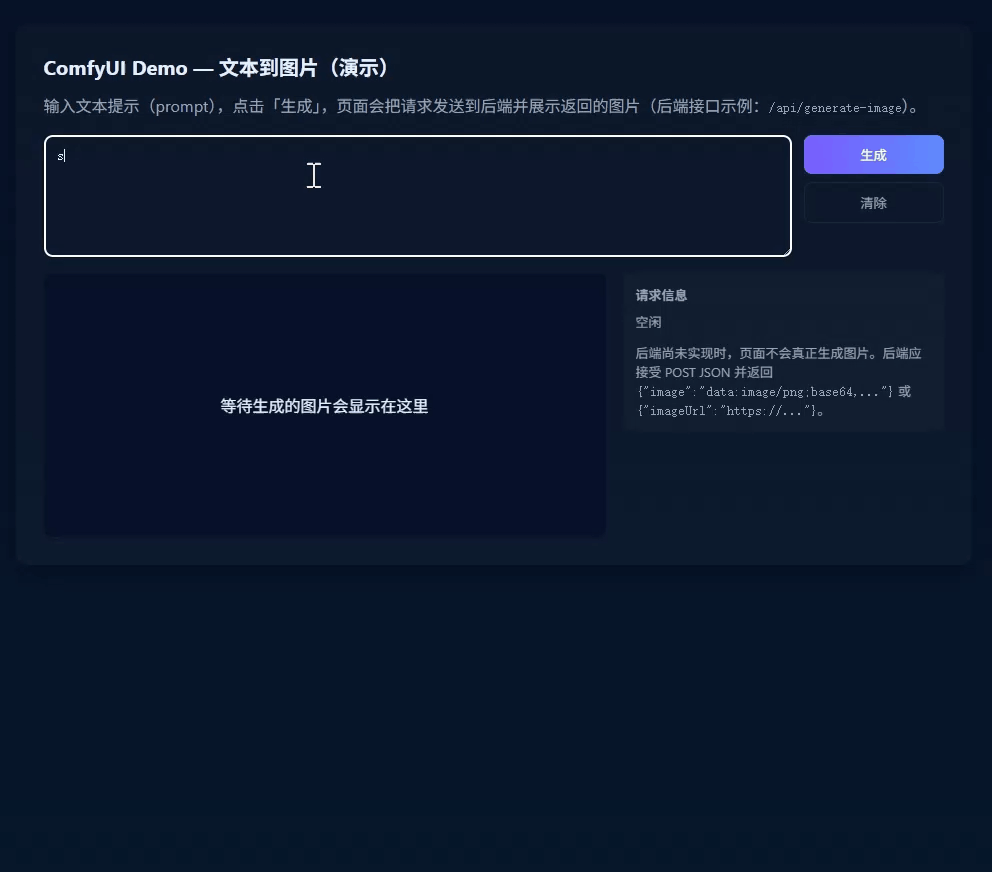
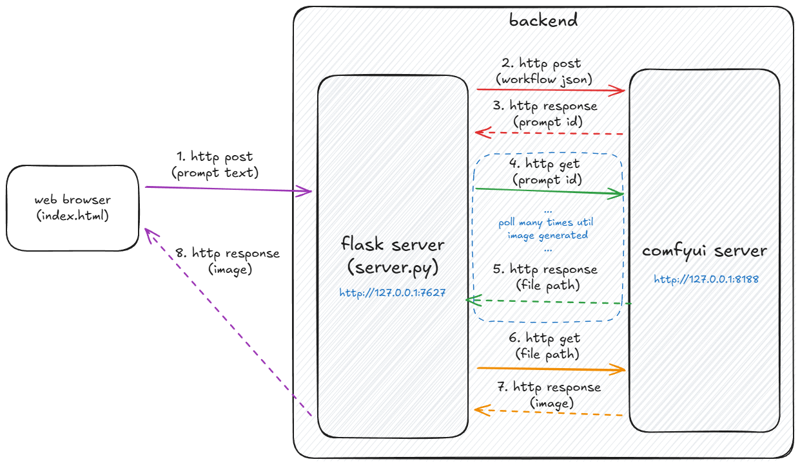
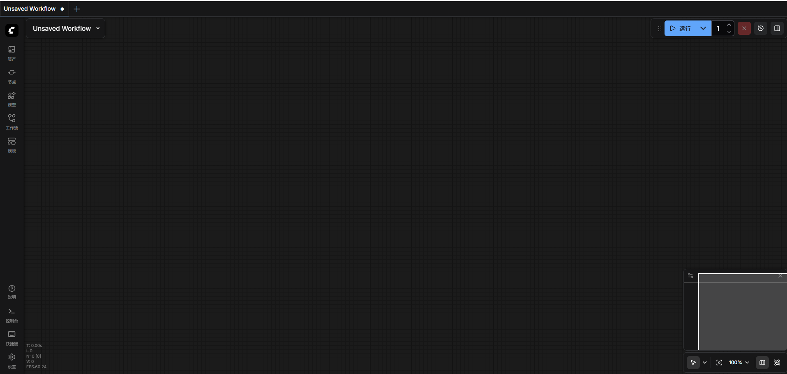
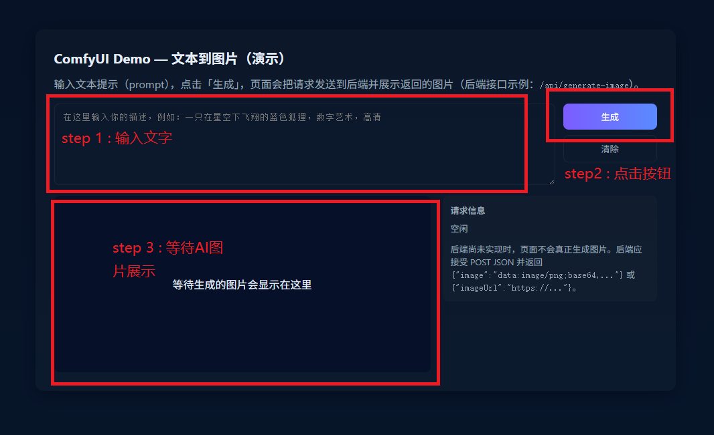
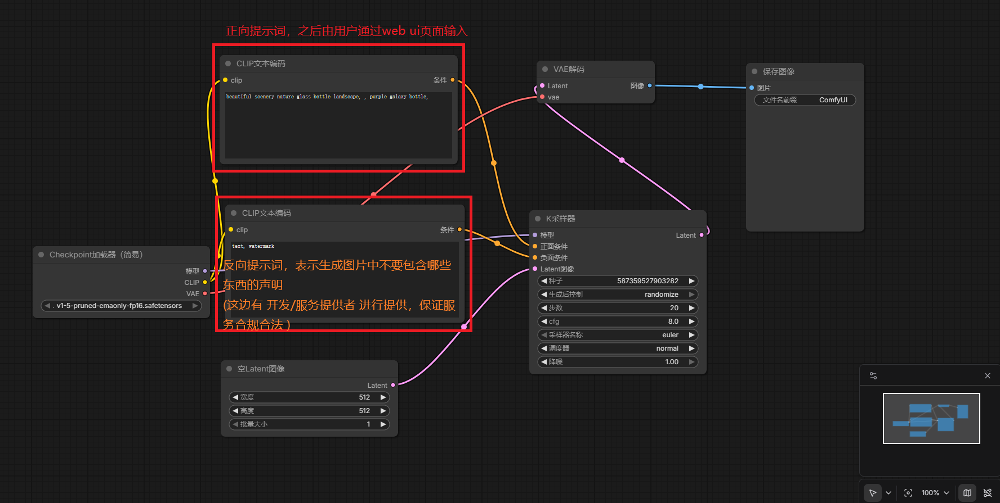

# ComfyUI — Usage and Practical Guide

If you're interested in building your own AI image-generation site (similar to OpenAI's interface), this guide walks you through enough to understand:

- What ComfyUI is
- How to expose a ComfyUI workflow as an HTTP API
- How to call that API from a frontend

Final demo (local deployment):

<p align="center"></p>

Call flow overview:

<p align="center"></p>

## Quick start

### Environment & dependencies
- Recommended OS: Windows
- Python: 3.12.7
- GPU: NVIDIA + CUDA

Note: This guide uses Windows for demonstrations. Paths and virtualenv commands differ slightly on Linux/macOS — adjust as needed.

```bash
# Clone ComfyUI
git clone https://github.com/comfyanonymous/ComfyUI.git
cd ComfyUI

# Create a Python virtual environment
cd ./source
py -m venv .venv
.venv\Scripts\activate.bat

# Install dependencies
pip install torch torchvision torchaudio --extra-index-url https://download.pytorch.org/whl/cu121
pip install -r requirements.txt
```

### Install & run
1. Download a model into `ComfyUI/models/checkpoints` (e.g. [v1-5-pruned-emaonly.ckpt](https://huggingface.co/runwayml/stable-diffusion-v1-5/resolve/main/v1-5-pruned-emaonly.ckpt)).
2. From the ComfyUI root run `python main.py`. If everything starts correctly, open `http://localhost:8188` in a browser to access the ComfyUI UI.
    <p align="center"></p>
3. Clone this repository and run the simple local text-to-image web app:
    ```bash
    cd posts/comfyui/source
    # activate your virtualenv (skip here)
    pip install -r requirements.txt
    python server.py
    ```
    Then open `http://127.0.0.1:7627/` in a browser to use the locally deployed demo.
    <p align="center"></p>

## Technical details

### 1. Create a ComfyUI workflow
Open ComfyUI in your browser and create a new workflow (or import an existing template).

Note: this article provides a high-level overview of the workflow process and does not dive into every node or parameter. For detailed node and parameter docs, see the <a href="https://docs.comfy.org/">official ComfyUI documentation.</a>

<p align="center"></p>

Demo (GIF):
<p align="center"></p>

In the demo I edit the positive and negative prompts, then click "Run" to generate images. While debugging a workflow you can change node parameters or add/remove nodes to modify the behavior. (Future article: detailed node types and parameter explanations.)

### 2. Expose a ComfyUI workflow via HTTP API
1. Export your workflow from ComfyUI as a JSON file (this repo includes `simple_workflow.json`). In that JSON you can see where prompt text is placed (for example, `6 > inputs > text` is the positive prompt and `7 > inputs > text` is the negative prompt).

2. Implement `server.py` (provided in `./source`).

    `server.py` core logic:

   - Accept request parameters from the frontend (positive prompt text).
   - Read `simple_workflow.json` from disk.
   - Replace the prompt fields in the JSON with the user-provided prompt.
   - POST the modified workflow to the local ComfyUI endpoint (default `http://127.0.0.1:8188/prompt`). The POST returns a `prompt_id`; you then poll the ComfyUI endpoint until the final image generation result is ready.
   - Return the generated image to the frontend for display.

### 3. Provide a simple frontend (`index.html`)
`server.py` serves a small static frontend (using FastAPI static files) that lets a user enter a prompt, click generate, and view the resulting image returned by the backend.

## References & resources

- ComfyUI: https://docs.comfy.org/ — Node-based GUI tooling for building customizable Stable Diffusion workflows.
- Hugging Face: https://huggingface.co — A broad platform for sharing models, datasets and ML applications.

## Next steps

- Optimize image retrieval flow
	- Currently the backend polls ComfyUI and returns the generated image in the HTTP response. This can be improved by studying how commercial image APIs handle async generation.

- Add more capabilities (image-to-image, text-to-video, image-to-video, etc.)
	- This demo supports basic text-to-image only; models and node parameters are not exhaustively tuned.

- Support generation history
	- The current frontend supports single-shot generation. Add a history feature so users can compare outputs from different prompts.

- Add contextual sessions
	- Each request is independent. Future work could allow users to iterate on a previous image or to build prompt series that relate to earlier results (this requires redesigning frontend interactions).

## Contributing & license

- To contribute to this blog or repo, please open a Pull Request.
- If you find issues or have suggestions, open an Issue.
- For deeper technical discussions you can contact via email:
	- 291225153@qq.com / hao1997.cao@gmail.com

